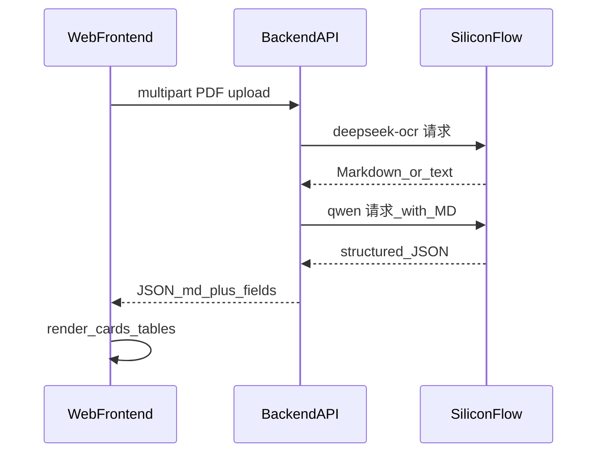

> **全 Phase 已落地（后端 + 前端）**  
> - 后端：[pdf_intel_backend/](pdf_intel_backend/)  
> - 前端：[pdf_intel_frontend/](pdf_intel_frontend/)  
> - 硅基文档：[SiliconFlow 文档](https://docs.siliconflow.com/) · 官网 [siliconflow.cn](https://www.siliconflow.cn)

# PDF → OCR(Markdown) → Qwen(结构化)

## 背景与约束

- 硅基流动提供 OpenAI 兼容 API（默认 `https://api.siliconflow.cn/v1`）。
- 本特性集中在 **`deepseek-ocr/`**，与仓库内 [metting_summary_system](../metting_summary_system) 等其它项目解耦。
- **OCR 模型**默认 `deepseek-ai/DeepSeek-OCR`；**Qwen 模型**默认 `Qwen/Qwen3-235B-A22B-Instruct-2507`，若控制台为 **Qwen-Max** 请在 `.env` 中改为控制台展示的 **精确 model id**。

## 总体数据流



## Phase 与 MVP（对照实现）

| Phase | 状态 | 说明 |
|--------|------|------|
| 1 | 完成 | `USE_MOCK` 或未配置密钥 → 固定 mock JSON |
| 2 | 完成 | DeepSeek-OCR，`SILICONFLOW_SKIP_QWEN=true` 时仅 OCR、`structured=null` |
| 3 | 完成 | Qwen 将 Markdown 转为 `structured`（JSON），失败则降级仅返回 `markdown` + `meta.warnings` |
| 4 | 完成 | Vite + React，`/api` 代理到本机后端 |
| 5 | 完成 | `.env` 固定路径加载、上传上限、CORS、启动日志、`environment.yml`、验证脚本 |

---

## Conda 环境与启动（完整步骤）

以下命令默认在**仓库根目录** `easyworktool/` 下执行；若你只在子目录工作，请将路径中的 `deepseek-ocr/` 理解为「本特性根目录」。

### 1. 创建并激活 Conda 环境

[`environment.yml`](environment.yml) 已声明：**Python 3.12**、**Node.js 20**（用于前端 `npm`），并通过 pip 安装后端 [`pdf_intel_backend/requirements.txt`](pdf_intel_backend/requirements.txt)。

```bash
cd deepseek-ocr
conda env create -f environment.yml
conda activate pdf-intel
```

若环境已存在、仅更新依赖：

```bash
conda env update -f environment.yml --prune
conda activate pdf-intel
```

> 若你更习惯「Conda 只管 Python、Node 单独装」，也可只用 `conda create -n pdf-intel python=3.12` 后手动 `pip install -r pdf_intel_backend/requirements.txt`，并自行安装 Node 20+。

### 2. 后端配置（`.env`）

```bash
cd deepseek-ocr/pdf_intel_backend
cp .env.example .env
# 用编辑器打开 .env，填写：
#   SILICONFLOW_API_KEY=（硅基控制台 API Key，不要加引号）
# 可选：
#   SILICONFLOW_MODEL_OCR=...
#   SILICONFLOW_MODEL_QWEN=...   （与控制台 Qwen-Max / 其它模型 id 一致）
#   USE_MOCK=false
#   SILICONFLOW_SKIP_QWEN=false
#   CORS_ORIGINS=http://localhost:5173,http://127.0.0.1:5173
```

**安全**：不要将 `.env` 提交到 Git（已在 [`pdf_intel_backend/.gitignore`](pdf_intel_backend/.gitignore) 中忽略）。

### 3. 安装前端依赖（npm）

```bash
cd deepseek-ocr/pdf_intel_frontend
npm install
```

### 4. 启动后端（终端 A）

```bash
conda activate pdf-intel
cd deepseek-ocr/pdf_intel_backend
# 若未在创建环境时自动装齐 pip 包，可执行：
pip install -r requirements.txt

uvicorn app.main:app --reload --host 127.0.0.1 --port 8765
```

注意：`app.main:app` 与 `--reload` **之间必须有空格**。

健康检查：

```bash
curl -sS http://127.0.0.1:8765/health | python -m json.tool
```

期望：`"phase": 5`，`ocr_live` 在有密钥且未 mock 时为 `true`。

### 5. 启动前端（终端 B）

```bash
conda activate pdf-intel
cd deepseek-ocr/pdf_intel_frontend
npm run dev
```

浏览器打开 **<http://localhost:5173>**，上传 PDF；开发模式下请求经 Vite 代理到 `http://127.0.0.1:8765`（见 [`pdf_intel_frontend/vite.config.ts`](pdf_intel_frontend/vite.config.ts)）。

### 6. 可选：命令行验证整条流水线（不打印 Key）

```bash
conda activate pdf-intel
cd deepseek-ocr/pdf_intel_backend
python scripts/verify_pipeline.py
```

### 7. 可选：单元测试（强制 MOCK，不调外网）

```bash
conda activate pdf-intel
cd deepseek-ocr/pdf_intel_backend
pip install -r requirements-dev.txt
pytest tests/ -v
```

---

## API 契约摘要

- **`GET /health`**：`phase`、`ocr_live`、`use_mock`、`skip_qwen`。
- **`POST /api/parse-pdf`**：`multipart/form-data`，字段名 **`file`**，`.pdf`；响应 JSON：`markdown`、`structured`（可为 `null`）、`meta`（`model_ocr`、`model_llm`、`warnings`、`mock`、`truncated_chars`）。

更多 curl 示例见 [`pdf_intel_backend/README.md`](pdf_intel_backend/README.md)。

---

## 目录布局

- [`pdf_intel_backend/app/`](pdf_intel_backend/app/)：FastAPI、`services/`（OCR + LLM）、`schemas.py`
- [`pdf_intel_frontend/`](pdf_intel_frontend/)：Vite + React 前端

---

## 依赖说明

| 层级 | 依赖 |
|------|------|
| Conda | `environment.yml`：`python=3.12`、`nodejs=20`、`pip -r pdf_intel_backend/requirements.txt` |
| 后端 pip | [`pdf_intel_backend/requirements.txt`](pdf_intel_backend/requirements.txt) |
| 后端开发测 | [`pdf_intel_backend/requirements-dev.txt`](pdf_intel_backend/requirements-dev.txt)（pytest） |
| 前端 | [`pdf_intel_frontend/package.json`](pdf_intel_frontend/package.json)（`npm install`） |

---

## 风险说明

- OCR 以 **PDF Base64** 调用多模态接口；若个别 PDF 失败，需对照 [硅基多模态文档](https://docs.siliconflow.cn/cn/userguide/capabilities/multimodal-vision) 排查或后续增加「按页转图」分支（保持 API 契约不变）。
