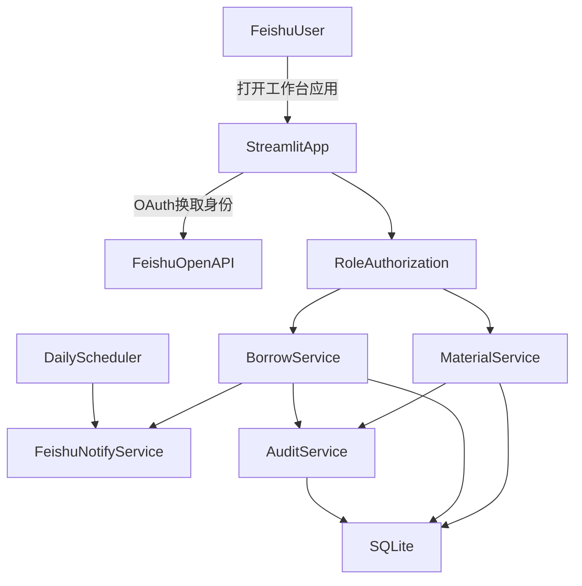

# 飞书工作台物资管理系统（MVP）实施计划

## 目标与边界

- 保持技术栈：`Streamlit + SQLite`。
- 作为飞书工作台网页应用（H5）使用，登录身份来自飞书。
- 首期聚焦可上线 MVP：物资台账、借用归还、管理员后台、飞书提醒、操作审计。

## 现状基线

- 当前项目仅有验证页面与飞书接入说明：
  - [app.py](/Users/shaver/cursor_projects/feishu-streamlit-verify/app.py)
  - [README.md](/Users/shaver/cursor_projects/feishu-streamlit-verify/README.md)
  - [FEISHU_SETUP.md](/Users/shaver/cursor_projects/feishu-streamlit-verify/FEISHU_SETUP.md)
  - [requirements.txt](/Users/shaver/cursor_projects/feishu-streamlit-verify/requirements.txt)
- 需要从“演示页”升级为“业务系统结构化应用”。

## MVP 功能设计（建议落地范围）

- 管理员能力：
  - 物资分类、物资建档（编号、名称、规格、数量、位置、责任人、图片、状态）。
  - 上下架与状态流转（可借、维修中、报废、下架）。
  - 库存调整与批量导入（CSV）。
  - 借用审批（可选：先默认自动通过，后续可加审批流）。
  - 日志审计（谁在何时执行了什么操作，前后值对比）。
- 普通用户能力：
  - 浏览物资目录与库存状态、搜索筛选。
  - 提交借用申请、查看我的借用、归还确认。
  - 到期提醒与逾期提醒（飞书消息）。
- 通知能力：
  - 借用成功通知、到期前 N 天提醒、逾期每日提醒、归还确认通知。

## 权限与身份模型

- 登录：通过飞书 OAuth 获取用户身份（`open_id/union_id`），在本地创建/绑定用户。
- 角色模型：`admin` / `user` 两类。
- 管理员配置来源（你要求的“配置文件可配置”）：
  - 新增配置文件维护管理员白名单（按 `open_id` 或邮箱）。
  - 系统启动时加载配置并写入角色缓存；后台可展示当前管理员列表（只读）。
- 权限控制策略：
  - 页面级：管理员页仅 `admin` 可见。
  - 接口级：所有写操作二次校验角色，避免仅靠前端隐藏。

## 数据库设计（SQLite）

- 核心表建议：
  - `users`：用户主数据（飞书标识、姓名、部门、角色、状态）。
  - `materials`：物资主数据（编码、分类、状态、总量、可借量、位置）。
  - `inventory_transactions`：库存流水（入库、出库、调整、报废）。
  - `borrow_orders`：借用单（申请人、借出时间、应还时间、实际归还时间、状态）。
  - `borrow_items`：借用单明细（物资、数量）。
  - `notifications`：通知记录（类型、接收人、发送状态、重试次数）。
  - `audit_logs`：审计日志（操作者、动作、目标对象、变更快照、IP/UA 可选）。
- 关键约束：
  - 可借数量不得小于 0。
  - 借出/归还必须写入库存流水与审计日志。
  - 软删除字段（`is_deleted`）优先于物理删除。

## 页面结构建议（Streamlit 多页）

- `首页仪表盘`：待归还数量、逾期数量、可借库存告警。
- `物资目录`：用户浏览与搜索。
- `我的借用`：当前借用、历史记录、归还入口。
- `管理员-物资管理`：建档、上下架、库存调整、批量导入。
- `管理员-借用管理`：借出处理、逾期处理。
- `管理员-日志中心`：审计日志与通知日志查询。
- `系统设置`：管理员白名单、提醒策略（提前天数、提醒频率）。

## 飞书通知与任务调度

- 通知通道：飞书机器人或应用消息 API。
- 调度方式（MVP 推荐）：
  - 启动一个轻量定时任务（例如 APScheduler）每日扫描应还/逾期记录。
  - 写入 `notifications` 表后发送，失败自动重试并记录。
- 防重策略：
  - 对同一借用单+同一提醒类型+同一天做幂等去重。

## 技术架构（MVP）

## 分阶段实施（2-4 周）

- 第 1 周：
  - 完成项目分层、SQLite 初始化迁移、用户与角色接入、基础页面框架。
- 第 2 周：
  - 完成物资管理与借还流程、库存一致性校验、审计日志。
- 第 3 周：
  - 完成飞书消息通知与定时提醒、失败重试、通知日志查询。
- 第 4 周（可压缩）：
  - 完成体验优化（筛选、导入、报表）、联调与上线文档。

## 文件改造建议（首轮）

- 保留并重构：
  - [app.py](/Users/shaver/cursor_projects/feishu-streamlit-verify/app.py)（改为应用入口与路由）
- 新增建议：
  - `config/app_config.toml`（管理员白名单、提醒策略）
  - `src/db/schema.sql`、`src/db/repository.py`
  - `src/auth/feishu_auth.py`、`src/auth/rbac.py`
  - `src/services/material_service.py`、`src/services/borrow_service.py`、`src/services/notify_service.py`
  - `src/pages/*.py`（按用户页/管理员页拆分）

## 验收标准（MVP）

- 飞书用户登录后可自动识别角色并展示不同菜单。
- 管理员可完成物资上下架、库存调整、日志查询。
- 普通用户可查询物资、发起借用、归还并查看提醒。
- 到期与逾期提醒可自动发送到飞书且有可追踪日志。
- 所有关键操作均可在审计日志中还原。

