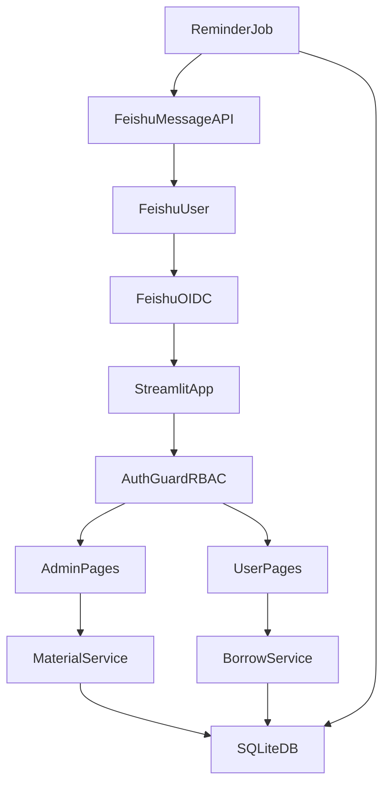

# 飞书工作台物资管理系统改造计划

## 目标与边界
- 保持技术栈：`Streamlit + SQLite`。
- 身份体系：飞书 `OAuth/OIDC` 登录；基于飞书用户身份做 RBAC（管理员/普通用户）。
- 管理员来源：配置文件可维护（支持热加载或重启生效）。
- 一期能力（MVP）：物资台账、上下架、入出库、借还、飞书提醒、看板统计、日志审计。

## 推荐功能设计（详细补充）
- **管理员端**
  - 物资主数据管理：物资编码、名称、分类、规格、单位、图片、存放位置、最小库存、状态（上架/下架）。
  - 库存与流水：入库、出库、盘点、调整，所有动作记录到库存流水（含操作者、时间、原因）。
  - 借还管理：借出登记、归还登记、逾期标记、损坏/丢失处理、手动催还。
  - 配置中心：管理员名单、提醒策略（提前 N 天、逾期频率）、消息模板、是否启用自动提醒。
  - 日志审计：登录日志、操作日志、消息发送日志、失败重试日志。
  - 看板报表：库存概览、低库存告警、借还趋势、逾期排行、按部门/人员统计。
- **普通用户端**
  - 物资浏览与检索：按分类/关键字筛选，查看可借数量与状态。
  - 借用申请与我的借用：发起申请、查看审批/借用状态、一键归还发起。
  - 归还提醒：飞书消息提醒（到期前、到期当日、逾期），并在页面展示待归还清单。
  - 消息中心：查看历史提醒、处理结果。
- **系统能力**
  - 权限中间层：页面级和动作级双重鉴权（仅管理员可上下架/库存调整/配置）。
  - 任务调度：定时扫描即将到期与逾期记录，触发飞书消息。
  - 幂等与容错：消息去重、失败重试、可观测日志。

## 数据模型（SQLite）
- `users`：飞书用户主数据（open_id/union_id、姓名、部门、是否激活）。
- `roles` 与 `user_roles`：角色与用户角色映射（admin/user）。
- `materials`：物资主表（状态、库存阈值、元数据）。
- `inventory_transactions`：库存流水（IN/OUT/ADJUST/CHECK）。
- `borrow_records`：借还记录（借出时间、到期时间、归还时间、状态）。
- `notifications`：消息记录（类型、接收人、发送状态、重试次数）。
- `audit_logs`：审计日志（动作、操作者、对象、前后值快照）。
- `system_configs`：可选系统配置（提醒开关、默认策略等）。

## 权限与登录方案
- 飞书登录完成后，在服务端换取用户身份并落地到 `users`。
- 管理员判定优先级：
  1) 配置文件白名单（主）；
  2) 数据库角色映射（辅，可用于后续扩展）；
- 权限校验落在统一函数：
  - 页面入口校验：管理员页不可见/不可访问；
  - 操作按钮校验：接口层再次校验，防止绕过前端。

## 飞书提醒策略建议
- 提醒类型：借用成功通知、到期前提醒（默认提前 3/1 天）、到期提醒、逾期每日提醒、归还确认。
- 推送渠道：飞书应用消息（优先）+ 可选群机器人备份。
- 发送策略：定时任务每小时扫描；同一借用记录同一提醒类型做幂等去重。
- 运维能力：失败消息重试（指数退避）、超限告警、可手动补发。

## 实施步骤（按阶段）
- **Phase 1：底座**
  - 建立项目分层：页面层、服务层、数据层、集成层。
  - 初始化 SQLite schema 与迁移脚本。
  - 接入飞书 OIDC 登录与会话管理。
  - 实现管理员配置文件读取与权限守卫。
- **Phase 2：核心业务**
  - 管理员：物资台账、上下架、库存流水、日志查询。
  - 用户：物资浏览、借用/归还、我的借用。
  - 基础看板：库存总览、低库存、借用状态分布。
- **Phase 3：消息与增强**
  - 飞书提醒任务与消息发送日志。
  - 逾期规则、催还机制、失败重试。
  - 报表增强与导出（CSV/Excel）。

## 关键文件改造建议
- 现有入口重构：[`/Users/shaver/cursor_projects/feishu-streamlit-verify/app.py`](/Users/shaver/cursor_projects/feishu-streamlit-verify/app.py)
- 依赖扩展：[`/Users/shaver/cursor_projects/feishu-streamlit-verify/requirements.txt`](/Users/shaver/cursor_projects/feishu-streamlit-verify/requirements.txt)
- 新增目录建议：
  - `config/admins.yaml`（管理员白名单与提醒策略）
  - `db/schema.sql`、`db/migrations/`
  - `services/auth_service.py`、`services/material_service.py`、`services/borrow_service.py`
  - `integrations/feishu_client.py`、`jobs/reminder_job.py`
  - `pages/admin_*`、`pages/user_*`

## 架构流转图

## 验收标准（MVP）
- 飞书用户可登录并识别身份。
- 管理员可进行物资上下架、库存调整、日志查询。
- 普通用户可浏览、借用、归还并收到到期/逾期提醒。
- 操作全链路有审计日志，关键失败可追踪。